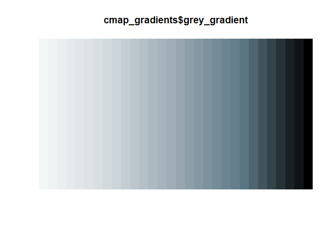
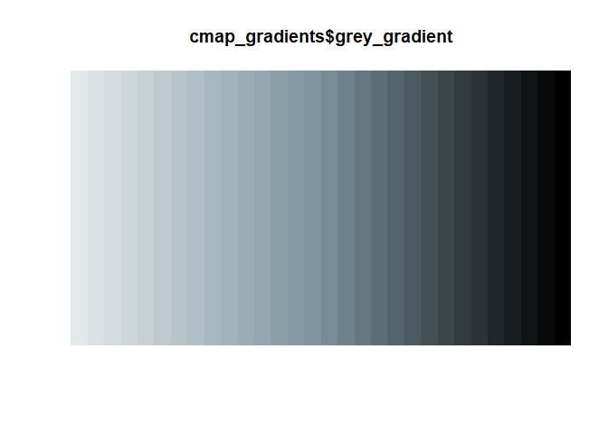
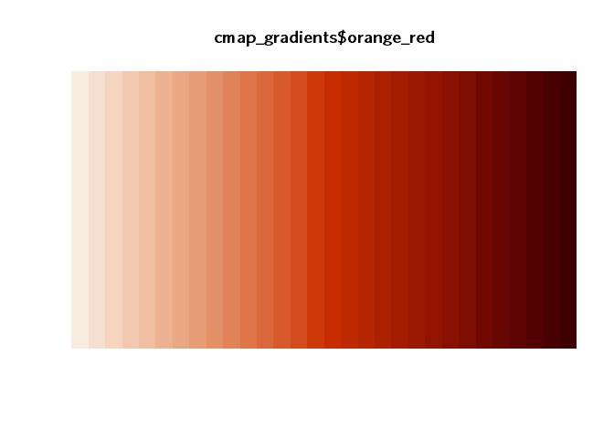
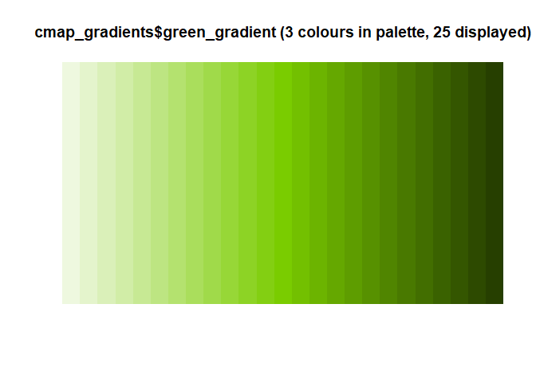

<!-- README.md is generated from README.Rmd. Please edit that file -->

# cmapplot

This R package provides themes and color scales for
[`ggplot2`](https://github.com/tidyverse/ggplot2), based on Chicago
Metropolitan Agency for Planning (CMAP) design guidelines.

## Installation

Run the following:

``` r
# install.packages("devtools")
devtools::install_github("CMAP-REPOS/cmapplot")
# then load the package as you would any other
library(cmapplot)
```

## Examples

For testing, the `cmap_plot` package contains a variety of sample
datasets. Each dataset has a man file that can be queried for additional
details. Datasets currently included are:

    #>  cluster_jobchange
    #>  economy_basic
    #>  grp_over_time
    #>  percentile_wages
    #>  pop_and_laborforce_by_age
    #>  traded_emp_by_race

The following provided code uses the sample datasets to produce
publishable or near-publishable graphics:

``` r
# A bar chart
ggplot(cluster_jobchange, aes(x = reorder(name, jobchange), y = jobchange, fill = category)) +
  geom_col() +
  coord_flip() +
  cmapplot::theme_cmap()


# a stacked bar chart
filter(traded_emp_by_race, variable %in% c("SpecializedTraded", "UnspecializedTraded")) %>%
ggplot(aes(x = reorder(Race, -value), y = value, fill = variable)) +
  geom_col(position = position_stack(reverse = TRUE)) +
  scale_y_continuous(labels = scales::percent) +
  theme_cmap()


# a grouped and stacked bar chart (via `interaction()`)
ggplot(pop_and_laborforce_by_age, aes(x = interaction(year, variable), y = value, fill = age)) +
  geom_col(position = position_stack(reverse = TRUE)) +
  theme_cmap()


# a grouped and stacked bar chart (via `interaction()`)
ggplot(economy_basic, aes(x = interaction(year, variable), y = value, fill = sector)) +
  geom_col(position = "fill") +
  scale_y_continuous(labels = scales::percent) +
  theme_cmap()


# a non-time-series line chart
ggplot(percentile_wages, aes(x = percentile, y = wage, color = cluster)) +
  geom_line() +
  theme_cmap()


# a time-series line chart
ggplot(grp_over_time, aes(x = year, y = realgrp, color = cluster)) +
  geom_line() +
  theme_cmap()
```

## Using CMAP palettes in R ggplot

Palettes based on the CMAP color palette can be applied directly to
ggplot graphics. The package contains both discrete and continuous color
palettes. Each type of palette can be applied to either the color or
fill attributes of a ggplot.

### Discrete palettes

Add discrete palettes by adding either a `cmap_fill_discrete` or
`cmap_color_discrete` object to a ggplot. Note that discrete palettes
will automatically interpolate additional colors if the dataset has more
colors than the palette. This can be helpful but is not ideal for
finished graphics.

``` r
ggplot(percentile_wages, aes(x = percentile, y = wage, color = cluster)) +
   geom_line() +
   cmap_color_discrete(palette = "prosperity") + 
   theme_minimal()
```

The following gradients are available:


### Continuous palettes

Add continuous palettes by adding either a `cmap_fill_continuous` or
`cmap_color_continuous` object to a ggplot. As in:

``` r
percentile_wages %>% 
  filter(cluster %in% c("Biopharaceuticals", "Hospitality and Tourism", "Paper and Packaging")) %>% 
  ggplot(., aes(x = cluster, y = wage, color = percentile)) +
  geom_point() +
  cmap_color_continuous(palette = "red_purple") +
  theme_minimal()
```

The following gradients are available:







