<!-- README.md is generated from README.Rmd. Please edit that file -->

# cmapplot

This R package provides themes and color scales for
[`ggplot2`](https://github.com/tidyverse/ggplot2), based on Chicago
Metropolitan Agency for Planning (CMAP) design guidelines.

## Installation

Run the following:

``` r
# install.packages("devtools")
devtools::install_github("CMAP-REPOS/cmapplot")
```

``` r
library(cmapplot)
```

# Discrete palettes

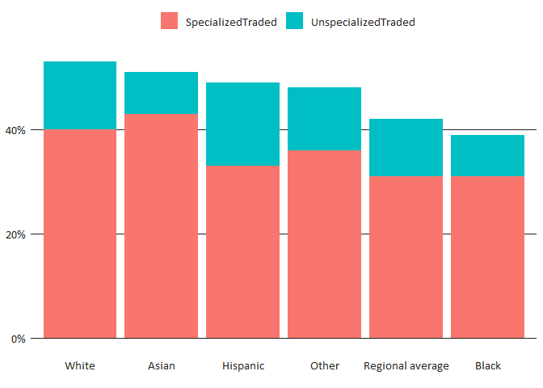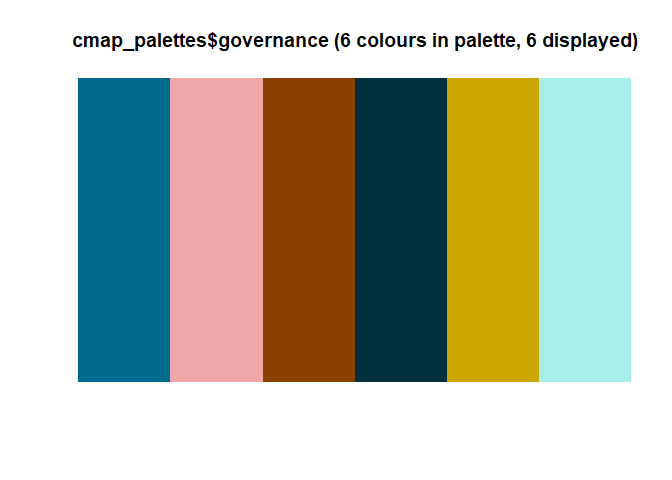

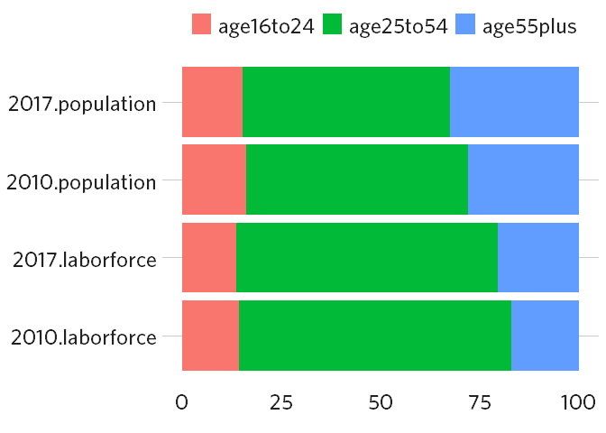

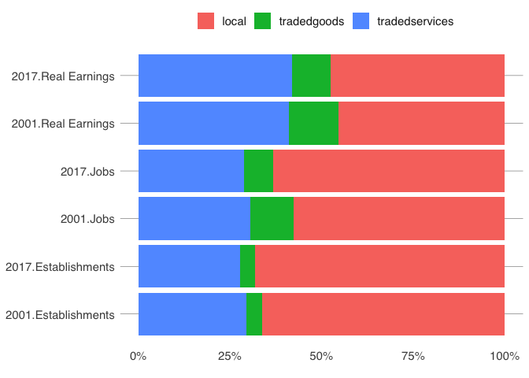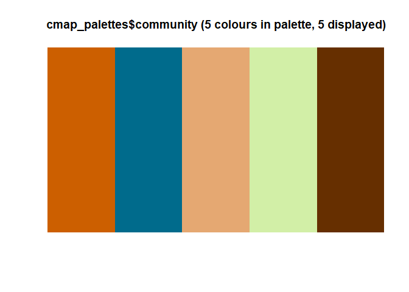

# Continuous palettes

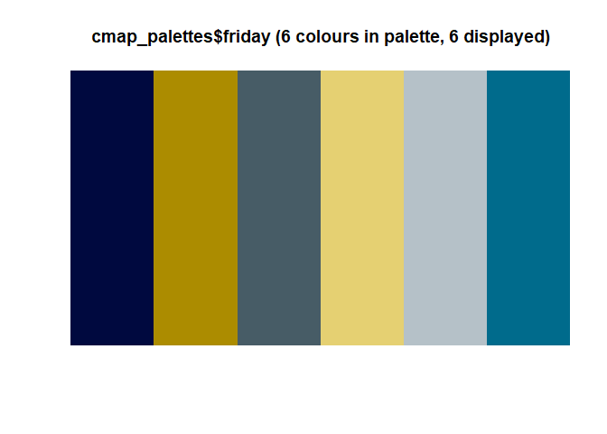

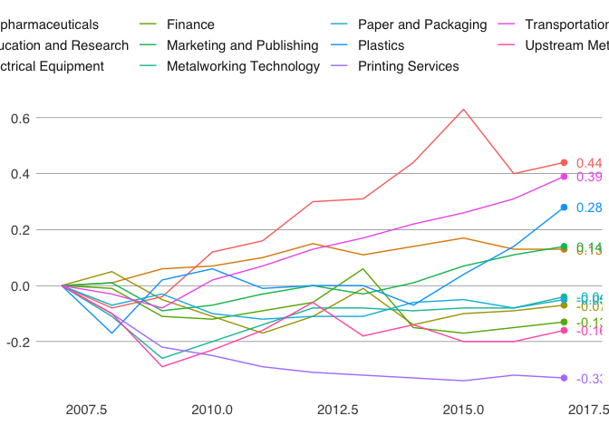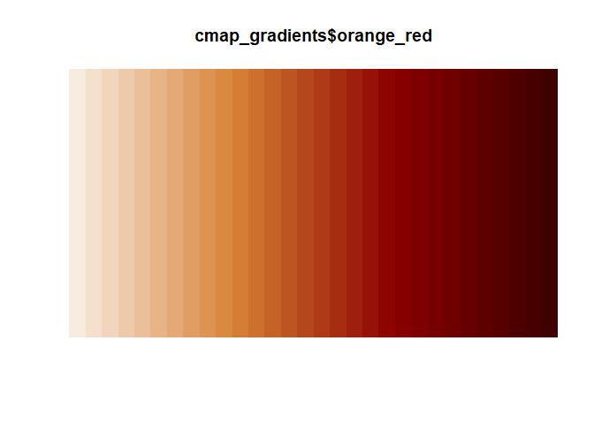

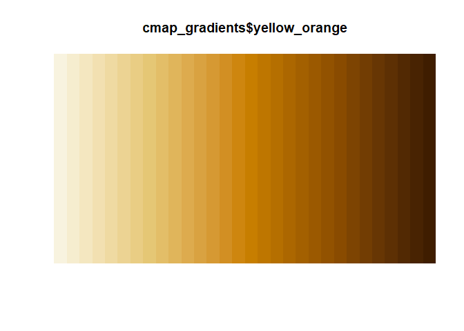

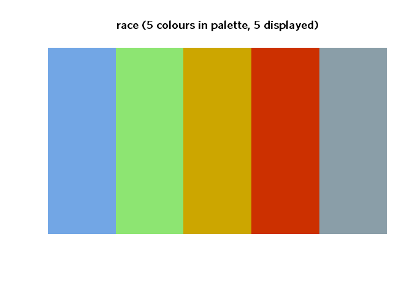

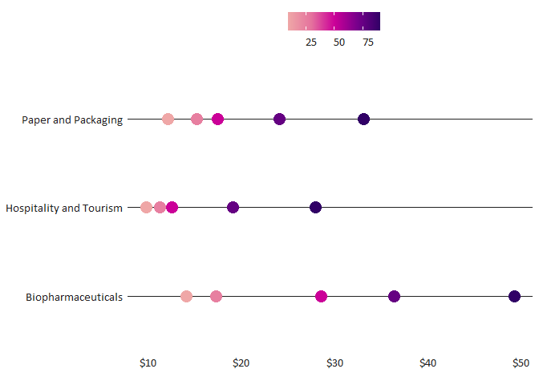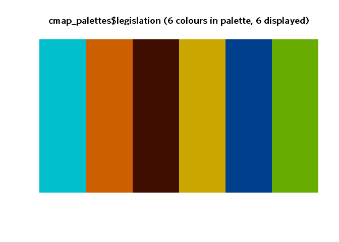

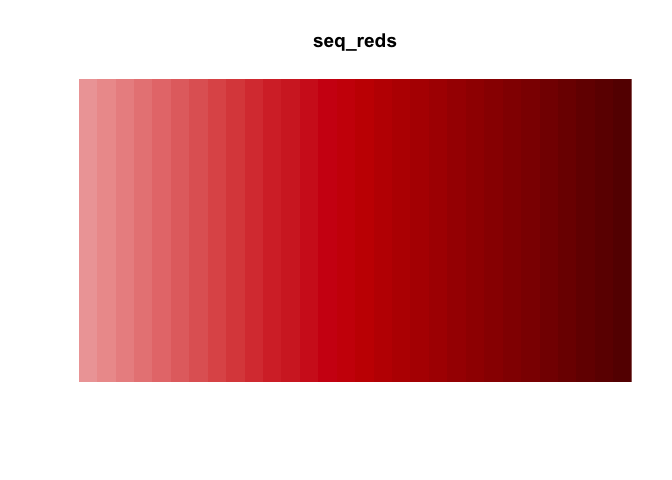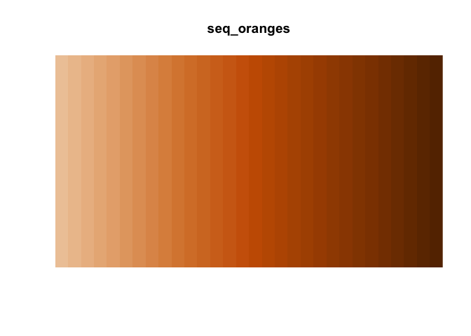

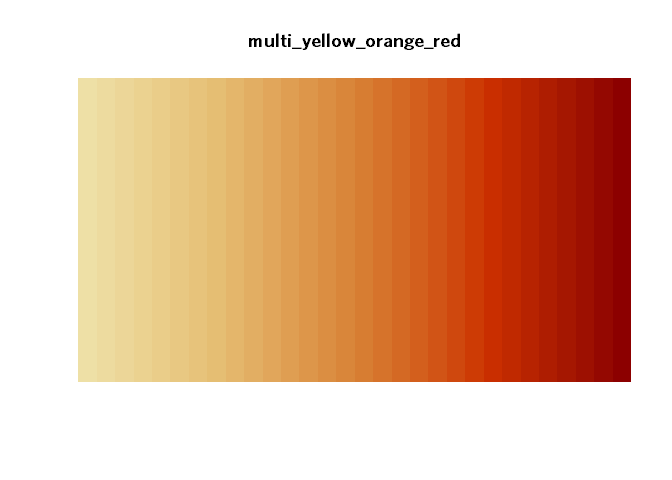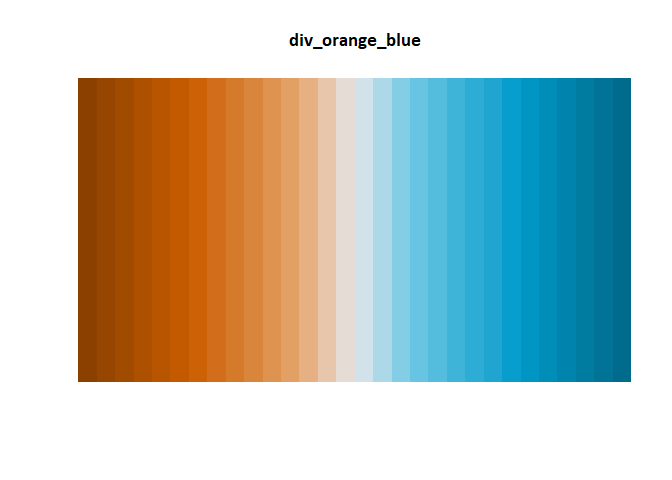

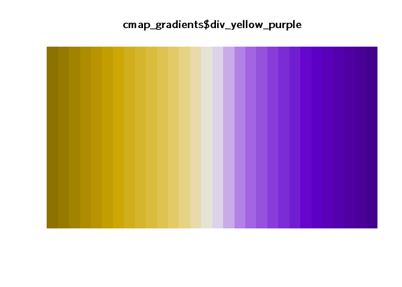
