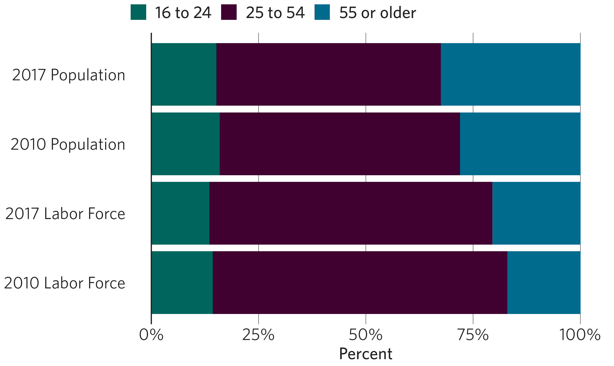
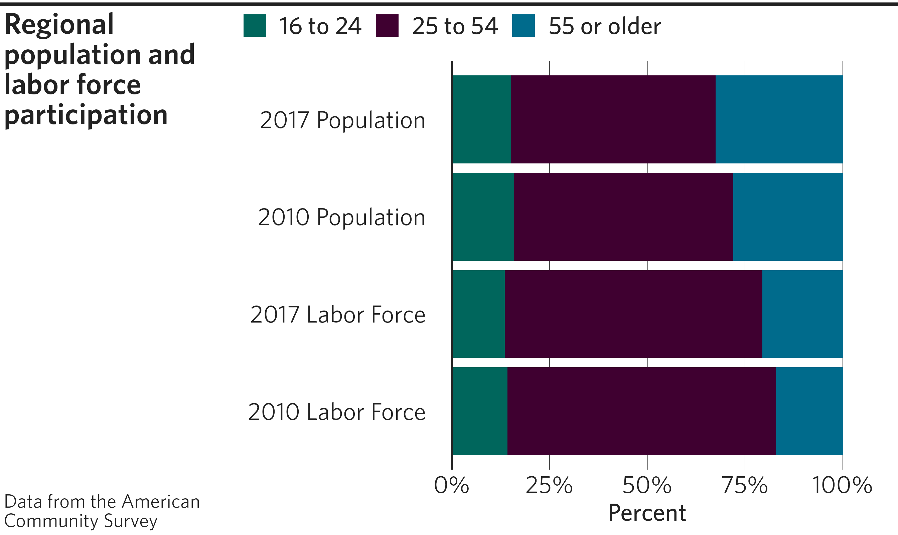

# cmapplot 

<!-- badges: start -->

<!-- badges: end -->

This R package provides themes, color scales, and other custom functions
for [ggplot2](https://github.com/tidyverse/ggplot2), based on Chicago
Metropolitan Agency for Planning (CMAP) design guidelines.

## The basics

The cmapplot package contains a few key components:

1.  Apply a CMAP theme to ggplots with `theme_cmap()`
2.  Easily provide common CMAP plot customization with custom geoms
    `geom_recessions()` and `geom_text_lastonly()`
3.  Apply CMAP colors using a variety of custom functions
    (e.g. `cmap_fill_discrete()`)
4.  Place the themed plot within a CMAP layout, and export the plot from
    R if desired with `finalize_plot()`

## Installation

Run the following to install or update cmapplot:

    ## Install current version from GitHub
    devtools::install_github("CMAP-REPOS/cmapplot", build_vignettes=TRUE)

    ## Then load the package as you would any other
    library(cmapplot)

**Important note:** cmapplot works best when installed on a Windows
computer with the Whitney family of fonts installed (specifically the
Book, Medium, and Semibold variants). To install on macOS, users must
install [XQuartz](https://www.xquartz.org) before cmapplot can be
loaded. (This can be easily accomplished via the
[Homebrew](https://brew.sh) package manager with the command
`brew cask install xquartz`.)

If installed on a Windows computer *without* Whitney, the package will
still work, but the fonts will default to Calibri. If installed on macOS
or Linux, the fonts will default to Arial, *even if Whitney is
installed.*

## CMAP theme and colors

The function `theme_cmap()` returns a complete ggplot2 theme that can be
added to a ggplot code block (similar to `ggplot2::theme_minimal()` or
`ggplot2::theme_bw`). Additionally, `theme_cmap()` accepts a variety of
arguments to additionally customize the theme output. CMAP color
functions apply colors from the CMAP color palette to the plot.

    ggplot(data = pop_and_laborforce_by_age, 
           aes(x = value,
               y = interaction(year, variable, sep = " "),
               fill = age)) +
      geom_col(position = position_stack(reverse = TRUE)) +
      scale_x_continuous(labels = scales::percent) +
      theme_cmap(xlab = "Percent",
                 gridlines = "v",
                 vline = 0) +
      cmap_fill_discrete(palette = "mobility")
    #> 'Whitney' font family not found. Using a substitute...

## Finalizing the plot

The function `finalize_plot()` places a ggplot within a frame defined by
CMAP design standards. It provides a variety of customization options
via arguments, and allows for in-R viewing and/or exporting in various
formats.

    finalize_plot(title = "Regional population and labor force participation",
                  caption = "Data from the American Community Survey",
                  width = 7, height = 4.25)

