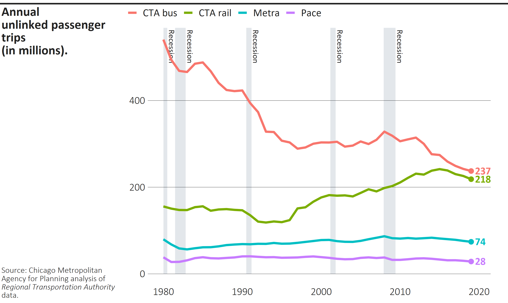
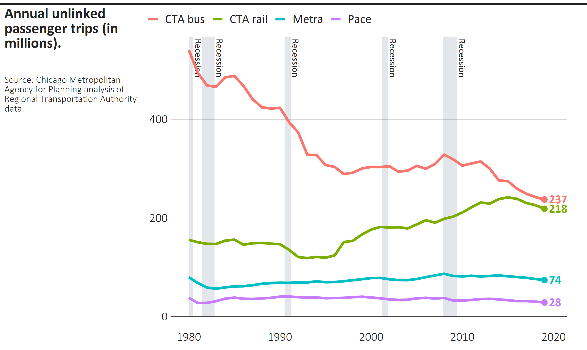
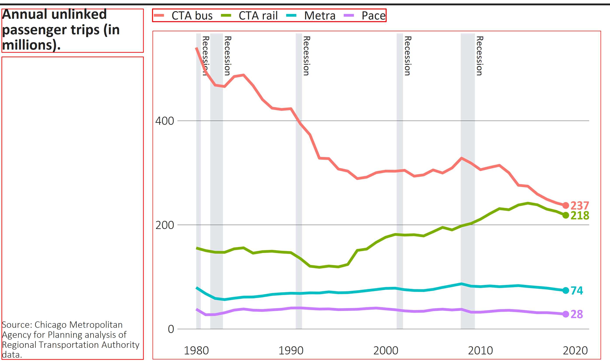
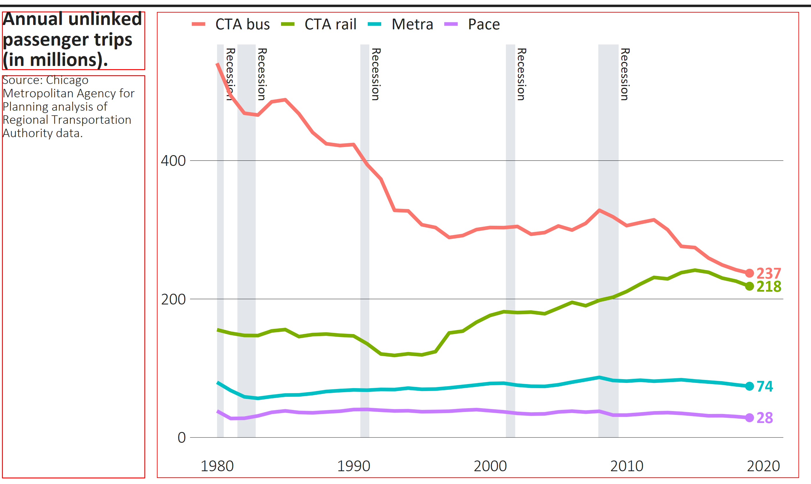

```{r setup, include = FALSE}
knitr::opts_chunk$set(
  collapse = TRUE,
  comment = "#>",
  fig.width = 7,
  fig.asp = 400/670,
  fig.retina = 4,
  fig.align = "center"
)

library(tidyverse)
library(cmapplot)
```

`finalize_plot()` will place a ggplot into a frame defined by CMAP design standards. It will align your title and caption to the left, add a horizontal line on top, and make other adjustments. It can show you the final plot and/or export it as a raster or vector file. This function will not apply CMAP design standards to the plot itself; use `theme_cmap()` for that.

The function has a number of customization options built in, accepting 16 (or more) arguments. Refer to the object documentation, `?finalize_plot`, for detailed information on all arguments.  

## Basic implementation

After creating a plot using one of the sample datasets included in the package and applying `theme_cmap()`, `finalize_plot()` produces the following output with title, caption, export mode, and filename arguments.  Note that the file will be exported to your current working directory if the full file path is not specified.
```{r bars, eval=TRUE}
# A bar chart
bar_chart <- ggplot(cluster_jobchange, aes(x = reorder(name, jobchange), y = jobchange, fill = category)) +
  geom_col() +
  coord_flip() +
  theme_cmap()
  
finalize_plot(bar_chart,
              title = "Cluster-level employment changes in the Chicago MSA, 2001-17",
              caption = "Source: Chicago Metropolitan Agency for Planning analysis",
              mode = "png",
              filename = "chart1.png")
              
```
{width=670px}

### Title and Caption Formatting

The title and caption blocks take HTML formatting, so you can manually set line breaks and font formatting.  
```{r bars1b, eval=TRUE}
# A bar chart
bar_chart <- ggplot(cluster_jobchange, aes(x = reorder(name, jobchange), y = jobchange, fill = category)) +
  geom_col() +
  coord_flip() +
  theme_cmap()
  
finalize_plot(bar_chart,
              title = "Cluster-level employment changes in the Chicago MSA, 2001-17",
              caption = "Source: Chicago <br> Metropolitan Agency <br> for Planning analysis",
              mode = "png",
              filename = "chart1b.png")
              
```
{width=670px}

## Adjusting positions with debug mode
Default values in `finalize_plot()` attempt to reflect CMAP design standards, but users can also manually adjust various elements of the finalized plot. The easiest way to identify current positions and how they relate to other objects within the finalized plot object is to set `debug = TRUE`:
```{r bars2, eval=TRUE}
# A bar chart
bar_chart <- ggplot(cluster_jobchange, aes(x = reorder(name, jobchange), y = jobchange, fill = category)) +
  geom_col() +
  coord_flip() +
  theme_cmap()
  
finalize_plot(bar_chart,
              title = "Cluster-level employment changes in the Chicago MSA, 2001-17",
              caption = "Source: Chicago Metropolitan Agency for Planning analysis",
              mode = "png",
              filename = "chart2.png",
              debug = TRUE)
              
```

{width=670px}

With debug on, we can easily see the effects of various adjustments, such as changing the width of the title and caption (`title_width`), the vertical alignment of the caption (`caption_valign`), and keeping the legend alignment of the original plot (`legend_shift`):
```{r bars3, eval=TRUE}
# A bar chart
bar_chart <- ggplot(cluster_jobchange, aes(x = reorder(name, jobchange), y = jobchange, fill = category)) +
  geom_col() +
  coord_flip() +
  theme_cmap()
  
finalize_plot(bar_chart,
              title = "Cluster-level employment changes in the Chicago MSA, 2001-17",
              caption = "Source: Chicago Metropolitan Agency for Planning analysis",
              mode = "png",
              filename = "chart3.png",
              title_width = 1.8,
              caption_valign = "top",
              legend_shift=FALSE,
              debug = TRUE)
              
```

{width=670px}

## Overrides

Any of the attributes defined in `cmapplot_globals$consts` can be changed by passing a named list to the overrides arguments.  Read more about these in `?cmapplot_globals()`. 

```{r bars4, eval=TRUE}
# A bar chart
bar_chart <- ggplot(cluster_jobchange, aes(x = reorder(name, jobchange), y = jobchange, fill = category)) +
  geom_col() +
  coord_flip() +
  theme_cmap()
  
finalize_plot(bar_chart,
              title = "Cluster-level employment changes in the Chicago MSA, 2001-17",
              caption = "Source: Chicago Metropolitan Agency for Planning analysis",
              mode = "png",
              filename = "chart4.png",
              caption_valign="top",
              overrides = list(margin_title_b=20, margin_title_l=5, margin_caption_l=5, 
                               margin_legend_t=10)
                )
              
```

{width=670px}
