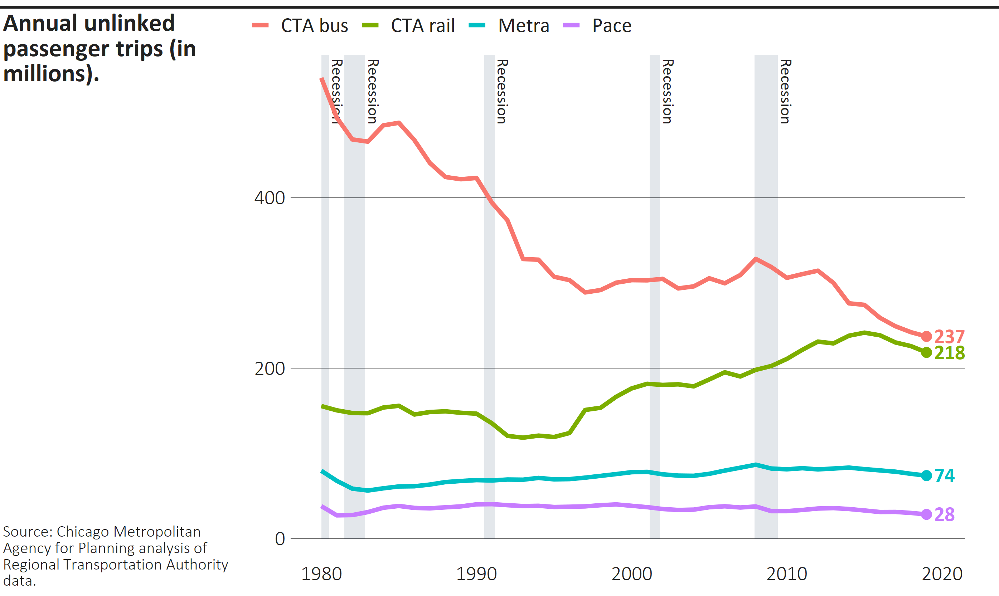

```{r setup, include = FALSE}
knitr::opts_chunk$set(
  collapse = TRUE,
  comment = "#>",
  fig.width = 7,
  fig.asp = 400/670,
  fig.retina = 4,
  fig.align = "center"
)

library(tidyverse)
library(cmapplot)

# clean up dataset
df <- transit_ridership %>% 
  filter(system != "pace_ada") %>% 
  mutate(system = case_when(
    system == "cta_bus" ~ "CTA bus",
    system == "cta_rail" ~ "CTA rail",
    system == "metra" ~ "Metra",
    system == "pace" ~ "Pace"
  ))

# build plot
p <- ggplot(data = df, 
            mapping = aes(x = year, y = ridership, color = system)) +
  geom_recessions(ymin = 0) +
  geom_line() +
  geom_text_lastonly(
    mapping = aes(label = round(ridership, digits = 0)), 
    add_points = TRUE,
    nudge_x = 0.5) +
  coord_cartesian(clip = "off") + 
  theme_cmap()
```

`finalize_plot()` will place a ggplot into a frame defined by CMAP design standards. It will align your title and caption to the left, add a horizontal line on top, and make other adjustments. It can show you the final plot and/or export it as a raster or vector file. This function will not apply CMAP design standards to the plot itself; use `theme_cmap()` for that.

The function has a number of customization options built in, accepting 16 (or more) arguments. Refer to the object documentation, `?finalize_plot`, for detailed information on all arguments.  

## Basic implementation

### Finalizing a plot with no customizations

After creating a plot and applying `theme_cmap()`, `finalize_plot()` produces the following output with title, caption, export mode, and filename arguments.  Note that the file will be exported to your current working directory if the full file path is not specified. 

For this example, we will use the final version of the line chart developed in the <a href="./plots.html">article</a> on `theme_cmap`.

```{r lines1, eval=TRUE}
# finalize and export plot
finalize_plot(p,
              title = "Annual unlinked passenger trips (in millions).",
              caption = "Source: Chicago Metropolitan Agency for Planning
              analysis of Regional Transportation Authority data.",
              mode = "png",
              filename = "chart1a.png")
              
```


### Exporting behavior

In that example, the only mode specified was `png`. However, you can specify multiple modes simultaneously using `finalize_plot()`, using the form `mode = c("png","pdf","plot")`. That would export the plot as both a `pdf` and `png`, as well as display it in the plotting window of your R console. 

When naming your exports, you can include only the name of the file (e.g., `"chart"`) if desired - `cmapplot` will automatically add the appropriate extension to each of your exported files (e.g., `"chart.pdf"` and `"chart.png"`). If a file with that name already exists in the specified directory, they will not be overwritten unless the user sets `overwrite = TRUE`. Users should be aware that PDFs will not allow overwriting if the existing file is open.

### Title and caption formatting

The title and caption blocks take HTML formatting, so you can manually set line breaks and font formatting.  
```{r lines1b, eval=TRUE}
# a finalized line graph, with text tweaks
finalize_plot(p,
              title = "Annual <br> unlinked passenger trips <br> (in millions).",
              caption = "Source: Chicago Metropolitan Agency for Planning
              analysis of <i>Regional Transportation Authority</i> data.",
              mode = "png",
              filename = "chart1b.png")
              
```


## Overrides

Any of the attributes defined in `cmapplot_globals$consts` can be changed by passing a named list to the `overrides` arguments. For example, the chart below uses the `overrides` argument to modify the margin below the title (`margin_title_b`), the margin to the left of the title and the caption (`margin_title_l`), and the margin above the legend (`margin_legend_t`).

You can read more about available options for customization in `?cmapplot_globals`.

```{r lines2, eval=TRUE}
# a finalized plot with some formatting overrides
finalize_plot(p,
              title = "Annual unlinked passenger trips (in millions).",
              caption = "Source: Chicago Metropolitan Agency for Planning
              analysis of Regional Transportation Authority data.",
              mode = "png",
              filename = "chart2.png",
              caption_valign = "top",
              overrides = list(margin_title_b = 30, 
                               margin_title_l = 5,
                               margin_legend_t = 10)
                )
              
```


## Adjusting positions with debug mode

### Enabling debug mode

Default values in `finalize_plot()` attempt to reflect CMAP design standards, but users can also manually adjust various elements of the finalized plot. The easiest way to identify current positions and how they relate to other objects within the finalized plot object is to set `debug = TRUE`:
```{r lines3, eval=TRUE}
# a debugged finalized plot
finalize_plot(p,
              title = "Annual unlinked passenger trips (in millions).",
              caption = "Source: Chicago Metropolitan Agency for Planning
              analysis of Regional Transportation Authority data.",
              mode = "png",
              filename = "chart3.png",
              debug = TRUE)
```


### Using debug to understand formatting shifts

With debug on, we can easily see the effects of various adjustments, such as changing the width of the title and caption (`title_width`), the vertical alignment of the caption (`caption_valign`), and keeping the legend alignment of the original plot (`legend_shift`):
```{r lines4, eval=TRUE}
# a debugged and modified finalized plot
finalize_plot(p,
              title = "Annual unlinked passenger trips (in millions).",
              caption = "Source: Chicago Metropolitan Agency for Planning
              analysis of Regional Transportation Authority data.",
              mode = "png",
              filename = "chart4.png",
              title_width = 1.8,
              caption_valign = "top",
              legend_shift = FALSE,
              debug = TRUE)
              
```


