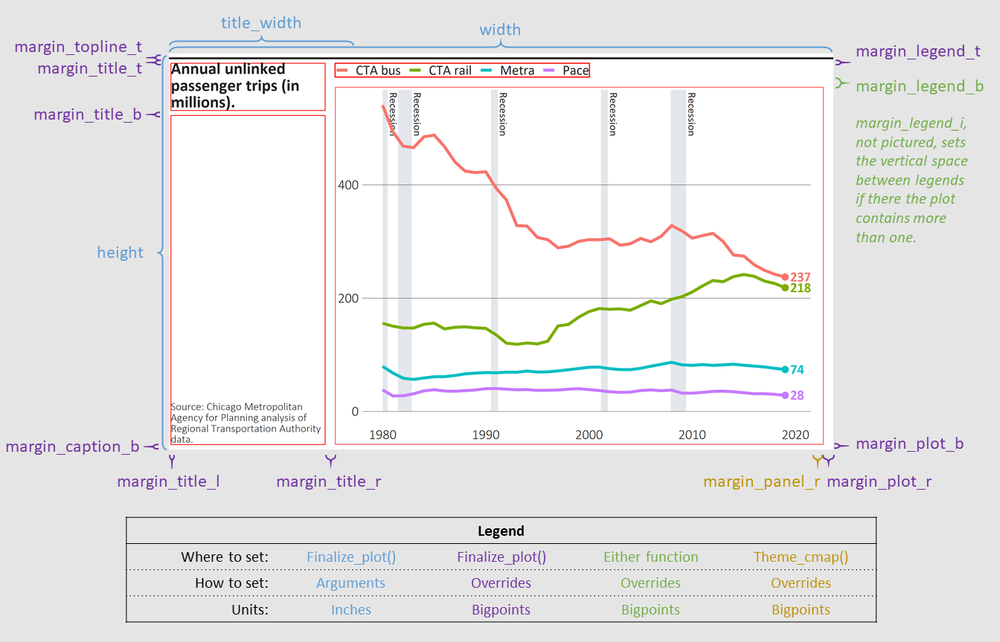

```{r setup, include = FALSE}
knitr::opts_chunk$set(
  collapse = TRUE,
  comment = "#>",
  fig.width = 670/72,
  fig.asp = 400/670,
  fig.retina = 4,
  fig.align = "center",
  out.width = "100%"
)

library(tidyverse)
library(cmapplot)

# clean up dataset
df <- transit_ridership %>% 
  filter(system != "pace_ada") %>% 
  mutate(system = recode_factor(system,
    cta_bus = "CTA bus",
    cta_rail = "CTA rail",
    metra = "Metra",
    pace = "Pace"
  ))

# build plot
p <- ggplot(data = df, 
            mapping = aes(x = year, y = ridership, color = system)) +
  geom_recessions(ymin = 0) +
  geom_line() +
  geom_text_lastonly(
    mapping = aes(label = round(ridership, digits = 0)), 
    add_points = TRUE,
    nudge_x = 0.5) +
  coord_cartesian(clip = "off") + 
  theme_cmap()
```

`finalize_plot()` will place a ggplot into a frame defined by CMAP design standards. It will align your title and caption to the left, add a horizontal line on top, and make other adjustments. It can show you the final plot and/or export it as a raster or vector file. This function will not apply CMAP design standards to the plot itself; use `theme_cmap()` for that.

In this vignette we will use the final version of the line chart developed in `vignette("plots")` to describe standard use of the `finalize_plot()` function. That plot is referenced in the following examples as `p`. The function has numerous additional customization options built in, accepting 16 (or more) arguments. Refer to the object documentation, `?finalize_plot`, for detailed information on all arguments.

## Basic implementation

### Finalizing a plot

After creating a plot and applying `theme_cmap()`, use `finalize_plot()` to complete the implementation of
CMAP design standards. You will probably want to set at least the `title` and `caption`, although the function will extract them from the ggplot if they were specified. 

As you are preparing the plot, you will likely want to view it within R. Do this by leaving leaving the default `mode = "plot"` to send the finished plot to the "Plots" tab within RStudio. Windows users may prefer `mode = "window"`, which draws the plot in a popup window. In both modes, the plot will show up "actual size" (depending on your screen's resolution) surrounded by a grey canvas.

```{r finalize1, fig.width=11, out.width="100%"}
finalize_plot(plot = p,
              title = "Annual unlinked passenger trips (in millions).",
              caption = "Source: Chicago Metropolitan Agency for Planning
                analysis of Regional Transportation Authority data.")
```

### Exporting a plot

Once you are happy with your plot, export it using `finalize_plot()` with one or more of the write modes `c("svg", "ps", "pdf", "png", "tiff", "jpeg", "bmp")` as well as the filename argument. If Communications staff will be modifying your graphic, they will require one of the vector formats (SVG or PDF). Although many raster formats are available, PNG is likely to look the best. 

You may specify multiple modes simultaneously using the form `mode = c("png", "pdf", "plot")`. That would export the plot as both a `pdf` and `png`, as well as display it in the plotting window of your R console. 

Some additional notes:

- If the full file path is not specified, the file will be exported to your current working directory (check with `getwd()`, change with `setwd(dir)`).

- If a file with the name specified already exists in the specified directory, it will not be overwritten unless the user sets `overwrite = TRUE`.

- When naming your exports, you do not need to include the extension (e.g., `"my_chart"`). `finalize_plot()` will automatically add the appropriate extension to each of your exported files (e.g., `"my_chart.pdf"` and `"my_chart.png"`). This is especially recommended if you're specifying multiple export modes in the same call.


<!-- The following code block is NOT evaluated, but its source code is displayed in order to demonstrate usage of the mode and filename parameters. -->
```{r finalize1a-forshow, eval=FALSE, echo=TRUE}
# Finalize and export plot to PNG and PDF
finalize_plot(plot = p,
              title = "Annual unlinked passenger trips (in millions).",
              caption = "Source: Chicago Metropolitan Agency for Planning
                analysis of Regional Transportation Authority data.",
              mode = c("png", "pdf"),
              filename = "finalized_plot.png")
```

<!-- The next code block IS evaluated to generate the graphic, but its source code is hidden because it does not demonstrate usage of the mode or filename parameters. -->
```{r finalize1a, eval=TRUE, echo=FALSE, message=FALSE}
finalize_plot(plot = p,
              title = "Annual unlinked passenger trips (in millions).",
              caption = "Source: Chicago Metropolitan Agency for Planning
                analysis of Regional Transportation Authority data.")
```

## Advanced customization

While `finalize_plot()` can be run successfully with very few arguments, the function allows many further customizations, a number of which are described here.

### Title and caption formatting

The title and caption blocks take HTML formatting, so you can manually set line breaks and font formatting.

```{r finalize1b, message=FALSE}
# A finalized line graph, with text tweaks
finalize_plot(plot = p,
              title = "Annual <br> unlinked passenger trips <br> (in millions).",
              caption = "Source: Chicago Metropolitan Agency for Planning
                analysis of <i>Regional Transportation Authority</i> data.")
```

### Using debug mode to fine-tune your plot

Default values in `finalize_plot()` attempt to reflect CMAP design standards, but users can also manually adjust various elements of the finalized plot. The easiest way to identify current positions and how they relate to other objects within the finalized plot object is to set `debug = TRUE`:

```{r finalize3, message=FALSE}
# A debugged finalized plot
finalize_plot(plot = p,
              title = "Annual unlinked passenger trips (in millions).",
              caption = "Source: Chicago Metropolitan Agency for Planning
                analysis of Regional Transportation Authority data.",
              debug = TRUE)
```

### Top-level position adjustments

In addition to setting the plot's `height` and `width`, `finalize_plot()` has a number of top-level arguments that impact the final layout. With debug on, we can easily see the effects of various adjustments, such as changing the width of the title and caption (`title_width`), altering the vertical alignment of the caption (`caption_valign`), or keeping the legend alignment of the original plot (`legend_shift`). Note that with `legend_shift = FALSE`, `finalize_plot()` does not separate the legend from the plot, as indicated by the debug boxes. 

```{r finalize4, message=FALSE}
# A debugged and modified finalized plot
finalize_plot(plot = p,
              title = "Annual unlinked passenger trips (in millions).",
              caption = "Source: Chicago Metropolitan Agency for Planning
                analysis of Regional Transportation Authority data.",
              title_width = 1.8,
              caption_valign = "top",
              legend_shift = FALSE,
              debug = TRUE)
```

### Overriding plotting constants

Any of the attributes defined in `cmapplot_globals$consts` can be changed by passing a named list to the `overrides` arguments. For example, the chart below uses the `overrides` argument to modify the margin below the title (`margin_title_b`), the margin to the left of the title and the caption (`margin_title_l`), and the margin above the legend (`margin_legend_t`). 

The [Many, many margins] section of this article describes most of these `consts` visually. To learn more about all possible overrides, see `?cmapplot_globals`.

```{r finalize2, message=FALSE}
# A finalized plot with some formatting overrides
finalize_plot(plot = p,
              title = "Annual unlinked passenger trips (in millions).",
              caption = "Source: Chicago Metropolitan Agency for Planning
                analysis of Regional Transportation Authority data.",
              caption_valign = "top",
              debug = TRUE,
              overrides = list(margin_title_b = 30, 
                               margin_title_l = 10,
                               margin_legend_t = 15))
```

### Many, many margins

The chart below includes a visual representation of many of the possible uses of `override`: 


You can also read more about all the available options for customization in `?cmapplot_globals`.
